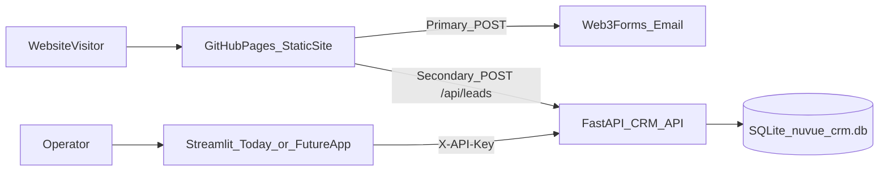
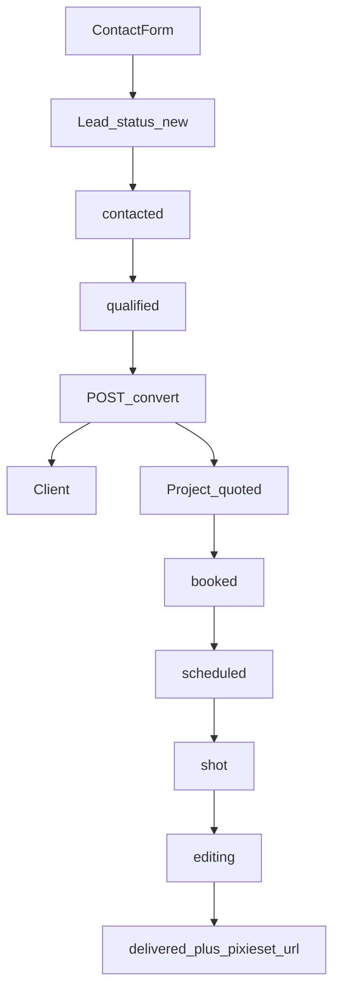
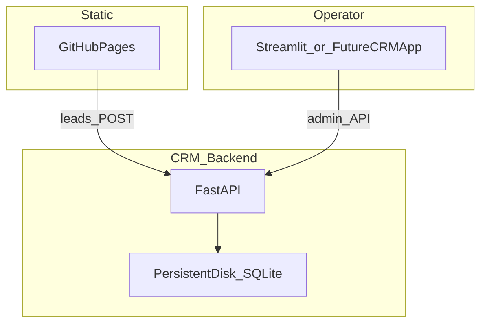

# NuVue CRM — Architecture, Intake & Deployment Guide

This document is the long-form source of truth for the NuVue Media CRM: how pieces fit together, how website inquiries become pipeline records, how to run everything locally, how to deploy the backend (separate from GitHub Pages), and the roadmap for replacing Streamlit with a real operator application.

For a short local quick-start, see [`crm/README.md`](../crm/README.md).

---

## 1. Purpose and scope

### What the CRM does

NuVue CRM tracks work from first contact through delivery:

**Website inquiry → Lead (Contact) → Client (Company) → Project (Deal) → Pixieset delivery**

| Stage | Meaning |
|-------|---------|
| **Inquiry** | Someone submits the contact form on the marketing site |
| **Lead / Contact** | A CRM record of that inquiry (lifecycle: new → contacted → …) |
| **Client / Company** | A converted account you work with ongoing |
| **Project / Deal** | A booked job (quoted → booked → … → delivered) |
| **Pixieset delivery** | Gallery URL stored on the project; clients access via Pixieset / site portal |

### What this document covers

- System architecture (site vs API vs operator UI vs database)
- Repository map and data model
- Local development runbooks
- Contact form dual-path intake (Web3Forms + CRM API)
- API reference and authentication
- Production hosting for the CRM (why not GitHub Pages)
- Streamlit’s current role and the target real CRM application
- Production checklist and troubleshooting

### What this document does not cover

- Pixieset account setup or gallery branding (see Pixieset’s own docs)
- Full GitHub Pages / static-site hosting how-to beyond CRM wiring
- Implementing the future React/Tauri CRM app (roadmap only; see §10)

---

## 2. System architecture

### High-level split

| Piece | Technology | Where it runs | GitHub Pages? |
|-------|------------|---------------|---------------|
| Marketing website | Static HTML / CSS / JS | GitHub Pages (or any static host) | **Yes** |
| Contact email | Web3Forms (browser POST) | Third-party SaaS | N/A (no NuVue server) |
| CRM API | FastAPI (Python) | Local machine or Render / Fly / VPS | **No** |
| CRM database | SQLite file | Disk next to the API (`crm/data/`) | **No** |
| Operator UI (today) | Streamlit | Local (or Streamlit Cloud later) | **No** |
| Operator UI (target) | Vite + React (+ optional Tauri) | Local / private URL / desktop app | **No** |

**Critical constraint:** GitHub Pages serves static files only. It cannot run FastAPI, Streamlit, or persist SQLite writes. The live site can *call* a CRM API elsewhere, but the CRM itself must be hosted on a Python-capable host with durable storage.

### Architecture diagram



### Runtime relationships

1. **Visitors** only interact with the static site. They never talk to Streamlit.
2. **Contact form** always tries Web3Forms first (email notification works without a backend).
3. **Contact form** then soft-posts the same payload to the CRM API *when* a production/local API URL is configured and reachable.
4. **You** operate the pipeline through the CRM UI, which talks only to the FastAPI API using `X-API-Key`.
5. **SQLite** is the system of record. Back up that file regularly.

---

## 3. Repository map

Paths are relative to the repo root.

### API (backend)

| Path | Role |
|------|------|
| [`crm/api/main.py`](../crm/api/main.py) | FastAPI app: routes, CORS, lead create, convert, stats |
| [`crm/api/models.py`](../crm/api/models.py) | SQLAlchemy models: Lead, Client, Project + status enums |
| [`crm/api/schemas.py`](../crm/api/schemas.py) | Pydantic request/response schemas |
| [`crm/api/auth.py`](../crm/api/auth.py) | `X-API-Key` dependency for admin routes |
| [`crm/api/config.py`](../crm/api/config.py) | Settings from `.env` (`CRM_API_KEY`, CORS, DB URL, Web3Forms) |
| [`crm/api/database.py`](../crm/api/database.py) | Engine, session, `init_db()` |
| [`crm/run_api.sh`](../crm/run_api.sh) | Local uvicorn launcher (`127.0.0.1:8000`) |
| [`crm/requirements.txt`](../crm/requirements.txt) | Python dependencies |
| [`crm/.env.example`](../crm/.env.example) | Env template (copy to `crm/.env`) |

### Database

| Path | Role |
|------|------|
| `crm/data/nuvue_crm.db` | SQLite database file (created at runtime; not required in git) |
| [`crm/data/.gitkeep`](../crm/data/.gitkeep) | Keeps the `data/` directory in the repo |

Default connection string (from config): `sqlite:///{CRM_ROOT}/data/nuvue_crm.db`.

### Operator UI (Streamlit — temporary)

| Path | Role |
|------|------|
| [`crm/app.py`](../crm/app.py) | Streamlit home entry |
| [`crm/pages/1_Dashboard.py`](../crm/pages/1_Dashboard.py) | Pipeline snapshot |
| [`crm/pages/2_Contacts.py`](../crm/pages/2_Contacts.py) | Leads list, edit, convert |
| [`crm/pages/3_Companies.py`](../crm/pages/3_Companies.py) | Clients |
| [`crm/pages/4_Deals.py`](../crm/pages/4_Deals.py) | Projects / pipeline |
| [`crm/crm_client.py`](../crm/crm_client.py) | HTTP client to FastAPI |
| [`crm/ui.py`](../crm/ui.py) | Shared Streamlit chrome / theme helpers |

### Website intake

| Path | Role |
|------|------|
| [`assets/js/crm-config.js`](../assets/js/crm-config.js) | Chooses local vs production API URL; sets `window.NUVUE_CRM_CONFIG` |
| [`assets/js/contact.js`](../assets/js/contact.js) | Form validation; Web3Forms submit; soft CRM `POST /api/leads` |
| Contact page (e.g. `contact/index.html` or `contact.html`) | Form UI; loads `crm-config.js` + `contact.js` |
| [`assets/js/portal.config.js`](../assets/js/portal.config.js) | Pixieset gallery URL for client portal (delivery side, not CRM DB) |

### Config env vars (API)

Defined in [`crm/.env.example`](../crm/.env.example) and loaded by [`crm/api/config.py`](../crm/api/config.py):

| Variable | Purpose |
|----------|---------|
| `CRM_API_KEY` | Shared secret for admin API calls (`X-API-Key`) |
| `CRM_CORS_ORIGINS` | Comma-separated origins allowed for browser POSTs |
| `CRM_DATABASE_URL` | Optional override; default is local SQLite under `crm/data/` |
| `WEB3FORMS_ACCESS_KEY` | Server-side key for API-triggered emails (non-website sources) |
| `WEB3FORMS_SUBJECT` / `WEB3FORMS_FROM_NAME` | Optional email metadata |

---

## 4. Data model

Source of truth: [`crm/api/models.py`](../crm/api/models.py).

### Lead (Contact)

Website inquiries and manually entered leads.

| Field | Notes |
|-------|--------|
| `id` | Primary key |
| `name`, `email`, `phone` | Contact info (`phone` optional) |
| `service` | Interest (e.g. Real Estate, Weddings & Events, Commercial, Other) |
| `message` | Inquiry body |
| `status` | Lifecycle stage (see below) |
| `notes` | Internal notes |
| `source` | Default `website`; other values can trigger server-side Web3Forms notify |
| `created_at`, `updated_at` | Timestamps |

**Lead statuses:** `new`, `contacted`, `qualified`, `converted`, `closed_lost`

### Client (Company)

Created when you convert a lead (or create manually via API).

| Field | Notes |
|-------|--------|
| `id` | Primary key |
| `name`, `email`, `phone`, `notes` | Account fields |
| `created_from_lead_id` | Optional unique link back to the source lead |

### Project (Deal)

Jobs tied to a client; optional link back to the source lead.

| Field | Notes |
|-------|--------|
| `id` | Primary key |
| `title`, `service` | Job identity |
| `status` | Pipeline stage (see below) |
| `shoot_date` | Optional date |
| `pixieset_url` | Gallery link when delivered |
| `notes` | Internal notes |
| `client_id` | Required FK to client |
| `source_lead_id` | Optional FK to lead |

**Project statuses:** `quoted`, `booked`, `scheduled`, `shot`, `editing`, `delivered`, `cancelled`

### Convert-lead flow

Authenticated endpoint: `POST /api/leads/{id}/convert`

Typical outcome:

1. Lead status moves toward / to `converted`
2. A **Client** row is created (linked via `created_from_lead_id`)
3. A **Project** (deal) is created under that client, optionally seeded from convert request fields

Exact payload fields live in [`crm/api/schemas.py`](../crm/api/schemas.py) (`ConvertLeadRequest` / `ConvertLeadResponse`). Use the interactive docs at `/docs` while the API is running.

### Domain flow



---

## 5. Local development (step-by-step)

### 5.1 One-time setup

```bash
cd crm
python3 -m venv .venv
source .venv/bin/activate   # Windows: .venv\Scripts\activate
pip install -r requirements.txt
cp .env.example .env
```

Edit `crm/.env` as needed. Local defaults often look like:

```
CRM_API_KEY=dev-local-api-key
CRM_CORS_ORIGINS=http://localhost:8080,http://127.0.0.1:8080,null
```

**Change `CRM_API_KEY` before any public deployment.**

### 5.2 Terminal 1 — API

```bash
cd crm
source .venv/bin/activate
./run_api.sh
```

Equivalent:

```bash
uvicorn api.main:app --reload --reload-dir api --host 127.0.0.1 --port 8000
```

`--reload-dir api` avoids WatchFiles thrashing on `.venv`.

| Check | URL |
|-------|-----|
| Health | [http://127.0.0.1:8000/health](http://127.0.0.1:8000/health) |
| OpenAPI docs | [http://127.0.0.1:8000/docs](http://127.0.0.1:8000/docs) |

On startup, the API creates/opens `crm/data/nuvue_crm.db`.

### 5.3 Terminal 2 — Streamlit CRM (current UI)

```bash
cd crm
source .venv/bin/activate
streamlit run app.py
```

In the sidebar, confirm:

- **API URL:** `http://127.0.0.1:8000`
- **API Key:** matches `CRM_API_KEY`

Pages: **Home / Dashboard**, **Contacts**, **Companies**, **Deals**.

### 5.4 Terminal 3 — Website (optional, for intake testing)

From the **repo root**:

```bash
python3 -m http.server 8080
```

Open the contact page (path depends on how the site is structured; commonly `/contact/` or `/contact.html`).

On localhost, [`assets/js/crm-config.js`](../assets/js/crm-config.js) uses `LOCAL_CRM_API_URL` (default `http://127.0.0.1:8000`) and enables intake.

### 5.5 Verify end-to-end locally

1. API health returns `{"status":"ok"}`
2. Streamlit Dashboard loads metrics without errors
3. Submit the contact form with valid fields
4. Confirm Web3Forms success toast (if configured on the form)
5. Confirm a new lead appears under **Contacts** (or `GET /api/leads` with `X-API-Key`)
6. If CRM soft-post fails, the browser console shows a warning but the visitor still sees success after email send

---

## 6. Contact form process (local vs production)

### Dual-path submit ([`assets/js/contact.js`](../assets/js/contact.js))

1. **Validate** name, email, service, message in the browser.
2. **Primary:** `POST` to Web3Forms (`contactForm.action`) with `FormData` — email notification; works on GitHub Pages with no NuVue backend.
3. **Secondary:** If `NUVUE_CRM_CONFIG.enabled` and `crmApiUrl` are set, `POST` JSON to `{crmApiUrl}/api/leads` with `source: "website"`.
4. **CRM failure is soft:** email success still shows the success dialog; CRM errors are `console.warn` only.

### Config rules ([`assets/js/crm-config.js`](../assets/js/crm-config.js))

| Hosting context | Behavior |
|-----------------|----------|
| Local / private LAN hostname | Uses `LOCAL_CRM_API_URL` (default `http://127.0.0.1:8000`); intake **on** if URL set |
| Public host (e.g. GitHub Pages) | Uses `PRODUCTION_CRM_API_URL` only |
| `PRODUCTION_CRM_API_URL` empty | Intake **off** on public hosts; console info explains why |
| Production page + loopback API URL | **Refused** — would silently fail for visitors; config clears the URL |

**Current production state:** If `PRODUCTION_CRM_API_URL` is still `""`, live site contact forms email via Web3Forms only. Leads are **not** auto-created in CRM until you deploy the API and set that URL.

### CORS

The API allows origins listed in `CRM_CORS_ORIGINS`, plus a regex for common local hosts (localhost, private LAN IPs). For production, set explicit site origins, for example:

```
CRM_CORS_ORIGINS=https://donkeykong1021.github.io,https://nuvueprod.com,https://www.nuvueprod.com
```

Mismatch between the Pages origin and `CRM_CORS_ORIGINS` causes browser CORS errors on `POST /api/leads`.

### Duplicate email behavior

- Website form already emails via **client-side** Web3Forms.
- API `POST /api/leads` with `source: "website"` does **not** send a second Web3Forms email (avoids duplicates).
- Non-website sources may trigger **server-side** Web3Forms notify when `WEB3FORMS_ACCESS_KEY` is set.

---

## 7. API reference

Base URL local: `http://127.0.0.1:8000`

### Health

| Method | Path | Auth | Description |
|--------|------|------|-------------|
| GET | `/health` | None | Liveness check |

### Leads

| Method | Path | Auth | Description |
|--------|------|------|-------------|
| POST | `/api/leads` | **Public** | Website / intake create lead |
| GET | `/api/leads` | `X-API-Key` | List (optional `status`, `q`) |
| GET | `/api/leads/{id}` | `X-API-Key` | Get one |
| PATCH | `/api/leads/{id}` | `X-API-Key` | Update fields / status |
| POST | `/api/leads/{id}/convert` | `X-API-Key` | Convert to client + project |

### Clients

| Method | Path | Auth | Description |
|--------|------|------|-------------|
| GET | `/api/clients` | `X-API-Key` | List |
| POST | `/api/clients` | `X-API-Key` | Create |
| GET | `/api/clients/{id}` | `X-API-Key` | Get one |
| PATCH | `/api/clients/{id}` | `X-API-Key` | Update |
| GET | `/api/clients/{id}/projects` | `X-API-Key` | Projects for client |

### Projects

| Method | Path | Auth | Description |
|--------|------|------|-------------|
| GET | `/api/projects` | `X-API-Key` | List |
| POST | `/api/projects` | `X-API-Key` | Create |
| GET | `/api/projects/{id}` | `X-API-Key` | Get one |
| PATCH | `/api/projects/{id}` | `X-API-Key` | Update (status, pixieset_url, …) |

### Stats

| Method | Path | Auth | Description |
|--------|------|------|-------------|
| GET | `/api/stats` | `X-API-Key` | Dashboard counts by lead/project status |

### Auth header (admin routes)

```
X-API-Key: <value of CRM_API_KEY>
```

Public `POST /api/leads` does **not** require the key (by design for website intake). Protect the API with CORS origin lockdown and rate limiting at the host if exposed publicly.

Interactive schemas: run the API and open `/docs`.

---

## 8. Deploying the CRM (not GitHub Pages)

### Recommended split

| Component | Host |
|-----------|------|
| Marketing site | **GitHub Pages** (keep as-is) |
| FastAPI + SQLite | **Render / Fly.io / Railway / small VPS** with a **persistent disk** |
| Operator UI (today) | Streamlit locally, or Streamlit Community Cloud pointed at the same API |
| Operator UI (target) | Private web app and/or Tauri desktop app against the same API |



### Why persistent disk matters

SQLite is a **file**. Ephemeral containers without a volume wipe `nuvue_crm.db` on every redeploy. Mount durable storage at `crm/data/` (or point `CRM_DATABASE_URL` at a path on that volume).

### Hosting options (summary)

| Option | Fit |
|--------|-----|
| **Render** Web Service + disk | Simple match for FastAPI + SQLite |
| **Fly.io** + volume | Similar; good Docker workflow |
| **Railway** + volume | Similar |
| **Small VPS** (DigitalOcean, Hetzner, …) | Full control; run API (+ later app) with systemd/Docker |
| **GitHub Pages / Cloudflare Pages alone** | **Not suitable** for the CRM API |
| **Serverless without durable DB** | Avoid for current SQLite design unless migrating to Postgres |

### Example: FastAPI process command

```bash
uvicorn api.main:app --host 0.0.0.0 --port $PORT
```

Working directory should be `crm/` (or adjust module path / `PYTHONPATH` accordingly).

### Production environment checklist (API)

1. Strong random `CRM_API_KEY` (not `dev-local-api-key`)
2. `CRM_CORS_ORIGINS` locked to real site origin(s)
3. Persistent volume for `crm/data/`
4. Optional: `WEB3FORMS_ACCESS_KEY` for non-website notify paths
5. HTTPS URL for the API (e.g. `https://nuvue-crm-api.onrender.com`)

### Wire the static site

1. Deploy API and confirm `/health`
2. Set `PRODUCTION_CRM_API_URL` in [`assets/js/crm-config.js`](../assets/js/crm-config.js) to that origin (no trailing path)
3. Commit and push so GitHub Pages picks up the config change
4. Submit a test contact from the **live** site; confirm lead in CRM

### Operator UI against production API

- Streamlit sidebar / env: `CRM_API_URL` = production API origin; `CRM_API_KEY` = production key
- Treat Streamlit (and the future app) as **private** — password-protect, VPN, or localhost-only until proper auth exists

### Backup

Copy `crm/data/nuvue_crm.db` on a schedule (manual download from the host, snapshot the volume, or automated job). That file **is** the CRM.

---

## 9. Why Streamlit is temporary

Streamlit is the **current operator UI only**. It is useful for prototyping HubSpot-style pages quickly, but it is not the long-term “application you run” for NuVue CRM.

### What Streamlit is good for today

- Fast iteration on Contacts / Companies / Deals screens
- Exercising the FastAPI contract while the product shape settles
- Local-only operation with minimal frontend tooling

### Limitations for a real CRM app

- Browser/Streamlit UX constraints (reruns, limited layout control)
- Not a double-clickable desktop product
- Awkward as a polished multi-user admin product without significant wrapping
- Deployment story (Streamlit Cloud) is separate from a branded NuVue app

### What stays when Streamlit goes away

- FastAPI API
- SQLite schema and data
- Website intake (`crm-config.js` + `contact.js`)
- Domain model (leads → clients → projects → Pixieset URL)

**Replace the UI; keep the API and database.**

---

## 10. Target CRM application (roadmap)

Implementation of this app is **out of scope for this document**; this section records the agreed direction so deployment and UI work stay aligned.

### Chosen direction

1. **Vite + React private web admin** that calls the existing FastAPI API with `X-API-Key` (or a future auth layer).
2. Optionally package later with **Tauri** as a Mac desktop app (`NuVue CRM.app`) that talks to local or hosted API.

### Screens to rebuild (parity with Streamlit)

| Screen | Responsibility |
|--------|----------------|
| **Dashboard** | Stats from `GET /api/stats`; recent contacts/deals |
| **Contacts** | List/filter/update leads; convert to company + deal |
| **Companies** | Clients CRUD / detail |
| **Deals** | Projects pipeline; edit status; store `pixieset_url` |

### Day-to-day run (future)

```bash
# Terminal 1 — API (unchanged)
cd crm && ./run_api.sh

# Terminal 2 — CRM app (future)
cd crm-app && npm run dev
# Later: open NuVue CRM.app
```

### Hosting the future app

- **Local-first:** React app on localhost against local or remote API
- **Private URL:** Host the built static SPA behind auth (or on a private host), still calling the FastAPI origin
- **Desktop:** Tauri wraps the same frontend

Do **not** put the admin UI on public GitHub Pages without authentication — it would expose the operator surface (even if the API key is not embedded, misconfiguration risk is high). Prefer env-based API key storage in the desktop/local app, not in a public static deploy.

### Migration sequence (recommended)

1. Keep Streamlit working against the API
2. Scaffold `crm-app` (Vite + React) with API client mirroring [`crm/crm_client.py`](../crm/crm_client.py)
3. Port Dashboard → Contacts → Companies → Deals
4. Switch daily use to the new app
5. Optionally Tauri package
6. Retire Streamlit pages when parity is confirmed

---

## 11. Production checklist

Use this when enabling live CRM intake and a durable backend.

1. **Provision** FastAPI host with a **persistent disk** mounted for SQLite (`crm/data/`).
2. **Set secrets:** strong `CRM_API_KEY`; `WEB3FORMS_ACCESS_KEY` if needed for non-website notifies.
3. **Lock CORS:** `CRM_CORS_ORIGINS` = exact GitHub Pages / custom domain origins.
4. **Deploy API;** verify `GET /health` over HTTPS.
5. **Set** `PRODUCTION_CRM_API_URL` in [`assets/js/crm-config.js`](../assets/js/crm-config.js); commit and deploy Pages.
6. **Point** Streamlit (or future app) at production `CRM_API_URL` + key; restrict who can open it.
7. **Test** a real contact form submission from the live site → lead appears in CRM.
8. **Convert** a test lead → client + project; set a sample `pixieset_url`.
9. **Schedule backups** of `nuvue_crm.db`.
10. **Document** the production API URL and who holds the API key (password manager).

---

## 12. Troubleshooting

| Symptom | Likely cause | What to do |
|---------|--------------|------------|
| Live site never creates leads; console says intake off | `PRODUCTION_CRM_API_URL` empty | Deploy API; set URL in `crm-config.js`; redeploy Pages |
| Console error about localhost API on public host | Loopback URL used in production | Never use `127.0.0.1` in production config; use public HTTPS API |
| Browser CORS error on `POST /api/leads` | Origin not allowed | Add exact site origin to `CRM_CORS_ORIGINS`; restart API |
| Streamlit “Could not reach CRM API” | API down or wrong URL/port | Start `./run_api.sh`; check sidebar URL |
| Streamlit `API 401` / invalid key | Key mismatch | Align sidebar / `CRM_API_KEY` env with `crm/.env` |
| Leads vanish after redeploy | No persistent disk | Attach volume; restore from backup if available |
| Email works, CRM empty, console warn | Soft CRM failure after Web3Forms success | Check API logs, CORS, network; email path is intentionally independent |
| Duplicate emails | Server notify + client Web3Forms | Website source skips server notify; check `source` and keys |
| Form success but no Web3Forms email | Form access key / Web3Forms config | Fix form `access_key` / dashboard settings (separate from CRM) |
| `/docs` works but site cannot POST | Mixed content or wrong protocol | Serve API on HTTPS when the site is HTTPS |

### Quick diagnostics

```bash
# API up?
curl -s http://127.0.0.1:8000/health

# Admin list (replace key)
curl -s -H "X-API-Key: dev-local-api-key" http://127.0.0.1:8000/api/stats
```

On the live site, open DevTools → Console / Network and inspect `crm-config` logs and the `/api/leads` request.

---

## Related files

- Short runbook: [`crm/README.md`](../crm/README.md)
- Intake config: [`assets/js/crm-config.js`](../assets/js/crm-config.js)
- Form logic: [`assets/js/contact.js`](../assets/js/contact.js)
- API entry: [`crm/api/main.py`](../crm/api/main.py)
- Models: [`crm/api/models.py`](../crm/api/models.py)
